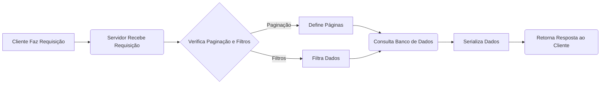

**Estrutura da Explicação**

1.  **Contexto:** O que é DRF e por que usar?
2.  **Problema:** Por que paginação e filtros são necessários?
3.  **Paginação:** Como implementar no DRF?
4.  **Filtros:** Como implementar no DRF?
5.  **Combinação:** Paginação e filtros juntos.
6.  **Benefícios:** Por que usar paginação e filtros?
7.  **Próximos passos:** O que aprender depois?

**Explicação Detalhada**

**1. Contexto: O que é DRF e por que usar?**

*   **O que é:** O Django REST Framework (DRF) é uma ferramenta poderosa para construir APIs RESTful em Python com Django.
*   **Por que usar:** Ele simplifica o desenvolvimento de APIs, fornecendo funcionalidades como serialização, autenticação, paginação, filtros e muito mais.
*   **Objetivo:**  O DRF ajuda a criar APIs eficientes, fáceis de usar e escaláveis.

**2. Problema: Por que paginação e filtros são necessários?**

*   **Grandes Volumes de Dados:** Imagine uma API que precisa lidar com milhares ou milhões de registros (por exemplo, uma lista de produtos, usuários, etc.).
*   **Problemas de Desempenho:** Retornar todos esses dados de uma vez pode ser extremamente lento, consumir muitos recursos do servidor e causar uma má experiência para o usuário.
*   **Requisitos de Filtragem:** Os usuários geralmente precisam filtrar e ordenar os dados de acordo com critérios específicos (por exemplo, buscar produtos por preço ou categoria).
*   **Solução:** A paginação divide os dados em partes menores (páginas) e os filtros permitem refinar a busca, resolvendo esses problemas.

**3. Paginação: Como implementar no DRF?**

*   **O que é:** A paginação divide uma lista de resultados em partes menores, retornando apenas uma "página" por vez.
*   **Tipos de Paginação no DRF:**
    *   `PageNumberPagination`: Numera as páginas (página 1, página 2, etc.).
    *   `CursorPagination`:  Usa um cursor para controlar a página atual, útil para grandes volumes de dados e dados em ordem cronológica.
    *  `LimitOffsetPagination`: Utiliza offset e limit.
*   **Exemplo com `PageNumberPagination`:**

    ```python
    # views.py
    from rest_framework.generics import ListAPIView
    from rest_framework.pagination import PageNumberPagination
    from .models import Consultation  # Importe seu modelo Consultation
    from .serializers import ConsultationSerializer # Importe seu serializador

    class ConsultationListView(ListAPIView):
        queryset = Consultation.objects.all()
        serializer_class = ConsultationSerializer
        pagination_class = PageNumberPagination  # Habilita paginação
        # A linha abaixo define quantos itens tera em cada pagina
        PageNumberPagination.page_size = 2 #numero de itens por pagina
    ```

*   **Configurações (settings.py):**

    ```python
    REST_FRAMEWORK = {
        'DEFAULT_PAGINATION_CLASS': 'rest_framework.pagination.PageNumberPagination',
        'PAGE_SIZE': 2,  # Defina o número de itens por página
    }
    ```

*   **Como usar:**
    *   O DRF automaticamente adiciona parâmetros de página na URL (ex: `/api/consultations?page=1`, `/api/consultations?page=2`).

**4. Filtros: Como implementar no DRF?**

*   **O que é:** Filtros permitem que os usuários refinar a busca de dados com base em critérios específicos.
*   **Tipos de Filtros no DRF:**
    *   `SearchFilter`: Permite pesquisar em campos específicos por texto.
    *   `OrderingFilter`: Permite ordenar os resultados por campos específicos.
    *   `DjangoFilterBackend`: Permite usar os filtros do Django (útil para filtragem mais complexa).
*   **Exemplo com `SearchFilter` e `OrderingFilter`:**

    ```python
     # views.py
    from rest_framework.generics import ListAPIView
    from rest_framework.pagination import PageNumberPagination
    from rest_framework.filters import SearchFilter, OrderingFilter
    from .models import Consultation  # Importe seu modelo Consultation
    from .serializers import ConsultationSerializer # Importe seu serializador

    class ConsultationListView(ListAPIView):
        queryset = Consultation.objects.all()
        serializer_class = ConsultationSerializer
        pagination_class = PageNumberPagination #Habilita paginação
        PageNumberPagination.page_size = 2 #numero de itens por pagina
        filter_backends = [SearchFilter, OrderingFilter] #habilita filtros
        search_fields = ['patient__name', 'doctor__name', 'description'] #campos buscaveis
        ordering_fields = ['date', 'time'] #campos ordenaveis

    ```
*   **Como usar:**
    *   `search`: Pesquise por texto (ex: `/api/consultations?search=consulta`).
    *   `ordering`: Ordene por campos (ex: `/api/consultations?ordering=date`).
    *   Combina filtros (ex: `/api/consultations?search=João&ordering=-date`).

**5. Combinação: Paginação e filtros juntos**

*   **Objetivo:** Use paginação e filtros para lidar com grandes conjuntos de dados de forma eficiente e proporcionar uma melhor experiência para o usuário.
*   **Exemplo:** `/api/consultations?page=2&search=rotina&ordering=-date`
    *   Retorna a página 2 das consultas que contêm a palavra "rotina" na descrição e ordenadas por data decrescente.

**6. Benefícios: Por que usar paginação e filtros?**

*   **Performance:**  APIs mais rápidas e eficientes, otimizadas para grande quantidade de dados.
*   **Escalabilidade:** APIs que podem lidar com um número crescente de dados e usuários.
*   **Experiência do Usuário:** Respostas rápidas e personalizadas, proporcionando melhor usabilidade.
*   **Facilidade:** Permite os usuários encontrar o que procura de uma maneira mais especifica
*   **Economia:** Economiza recursos do sistema

**7. Próximos passos:**

*   **Explore outros tipos de filtros:** `DjangoFilterBackend` para filtragem mais avançada.
*   **Personalize filtros e paginação:** Ajuste para necessidades específicas.
*   **Documente sua API:** Explique como usar paginação e filtros.
*   **Implemente Autenticação:** Proteja sua api

**Código de exemplo:**

```python
# app/models.py
from django.db import models

class Doctor(models.Model):
    name = models.CharField(max_length=255)

class Patient(models.Model):
    name = models.CharField(max_length=255)

class Consultation(models.Model):
    date = models.DateField()
    time = models.TimeField()
    description = models.CharField(max_length=255)
    patient = models.ForeignKey(Patient, on_delete=models.CASCADE)
    doctor = models.ForeignKey(Doctor, on_delete=models.CASCADE)

# app/serializers.py
from rest_framework import serializers
from .models import Consultation

class ConsultationSerializer(serializers.ModelSerializer):
    patient_name = serializers.CharField(source='patient.name', read_only=True)
    doctor_name = serializers.CharField(source='doctor.name', read_only=True)
    class Meta:
        model = Consultation
        fields = ['id', 'date', 'time', 'description', 'patient', 'doctor', 'patient_name','doctor_name']

# app/views.py
from rest_framework.generics import ListAPIView
from rest_framework.pagination import PageNumberPagination
from rest_framework.filters import SearchFilter, OrderingFilter
from .models import Consultation
from .serializers import ConsultationSerializer

class ConsultationListView(ListAPIView):
    queryset = Consultation.objects.all()
    serializer_class = ConsultationSerializer
    pagination_class = PageNumberPagination
    PageNumberPagination.page_size = 2
    filter_backends = [SearchFilter, OrderingFilter]
    search_fields = ['patient__name', 'doctor__name', 'description']
    ordering_fields = ['date', 'time']

# settings.py
REST_FRAMEWORK = {
    'DEFAULT_PAGINATION_CLASS': 'rest_framework.pagination.PageNumberPagination',
    'PAGE_SIZE': 2,
}

# app/urls.py
from django.urls import path
from .views import ConsultationListView

urlpatterns = [
    path('consultations/', ConsultationListView.as_view(), name='consultation-list'),
]
```
**Exemplo de Requisições:**

-   **Listar Todas as Consultas:**
    ```bash
    curl http://127.0.0.1:8000/api/consultations/
    ```
-   **Listar todas as consultas com paginação (página 2):**
    ```bash
        curl http://127.0.0.1:8000/api/consultations/?page=2
    ```
-   **Listar todas as consultas com paginação (página 2) e filtrando por paciente**
    ```bash
        curl http://127.0.0.1:8000/api/consultations/?page=2&search=consulta
    ```
-   **Listar todas as consultas com paginação (página 2) e ordenado por data**
    ```bash
        curl http://127.0.0.1:8000/api/consultations/?page=2&ordering=date
    ```
-   **Listar todas as consultas com paginação (página 2), filtrando por paciente e ordenando por data**
    ```bash
        curl http://127.0.0.1:8000/api/consultations/?page=2&search=consulta&ordering=date
    ```
**Aprimoramentos**
-   **Documentação:** Utilize ferramentas como Swagger ou Redoc para documentar a API, incluindo detalhes sobre paginação e filtros.
-   **Customização:** Crie classes de paginação e filtros customizados para atender a necessidades específicas.
-   **Testes:** Implemente testes para verificar o funcionamento correto da paginação e filtros.
-   **Validação:** Valide os dados de entrada para evitar erros e vulnerabilidades.

**Diagrama de Fluxo**



**Observações Finais**

*   Adapte os exemplos de acordo com a sua modelagem de dados.
*   Experimente e ajuste as configurações do DRF para obter o comportamento desejado.
*   Use a documentação oficial do DRF para aprofundar seus conhecimentos.

Com esta explicação organizada e detalhada, você estará pronto para criar APIs eficientes e escaláveis com paginação e filtros no Django REST Framework. Se tiver mais dúvidas, é só perguntar!
