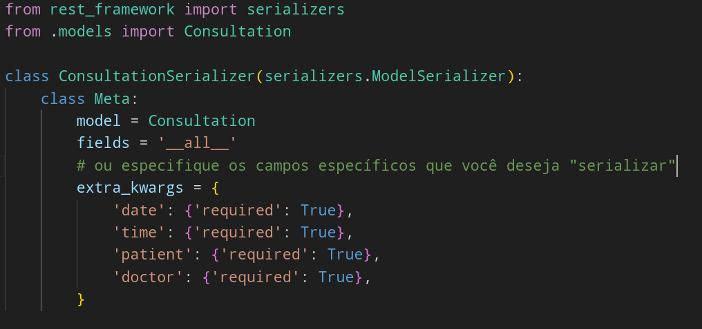
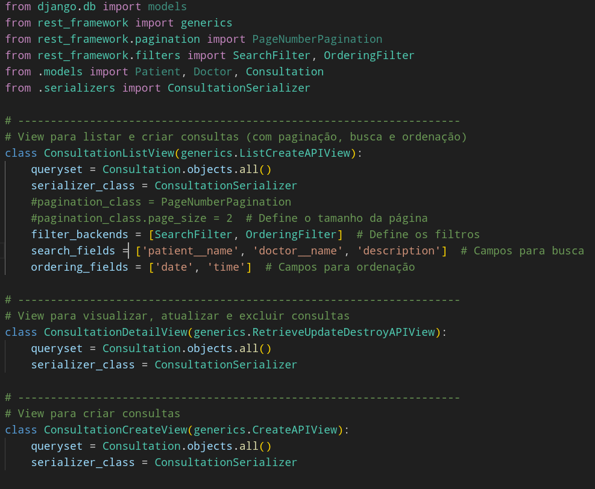
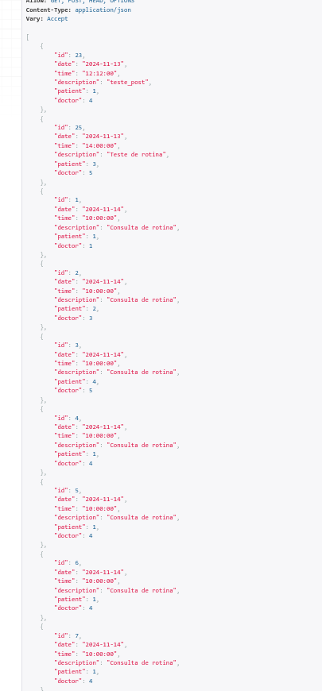
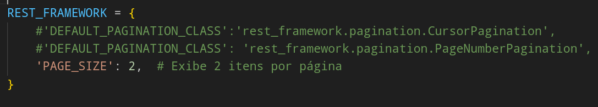
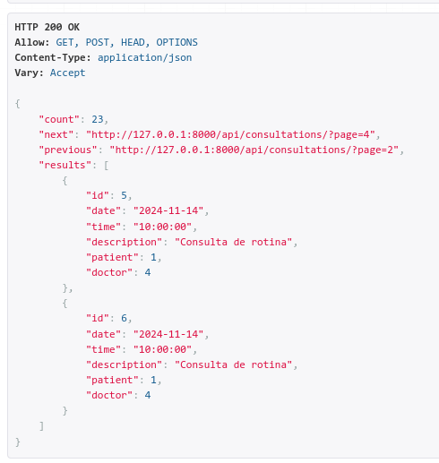
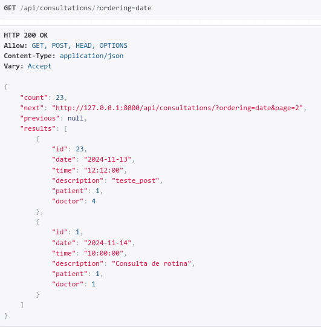
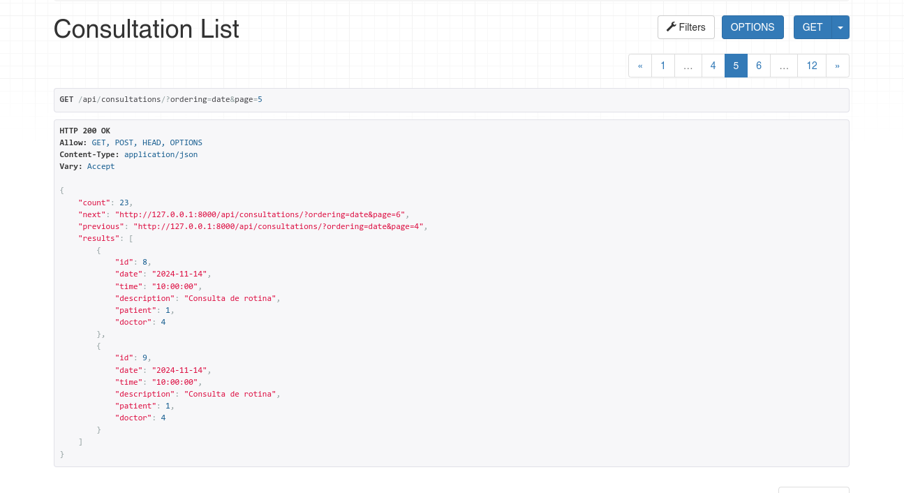
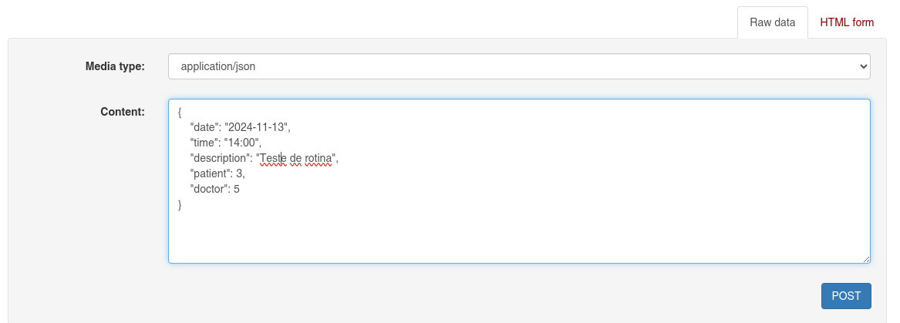
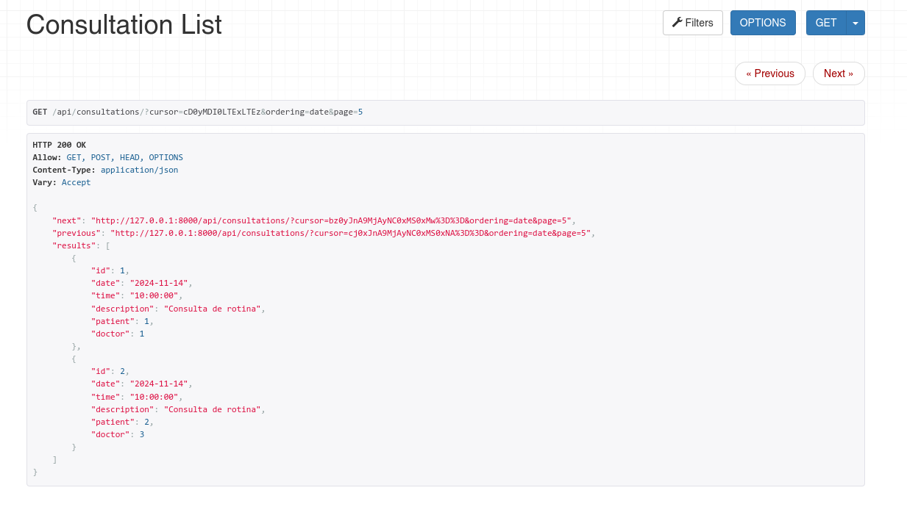

curl -X POST -H "Content-Type: application/json" -d '{
  "date": "2024-11-14",
  "time": "10:00",
  "patient": 1,
  "doctor": 4,
  "description": "Consulta de rotina"
}' http://127.0.0.1:8000/api/consultations/

curl http://127.0.0.1:8888/api/consultations/?page=3  
[{"id":1,"date":"2024-11-14","time":"10:00:00","description":"Consulta de rotina","patient":1,"doctor":1},{"id":2,"date":"2024-11-14","time":"10:00:00","description":"Consulta de rotina","patient":2,"doctor":3},{"id":3,"date":"2024-11-14","time":"10:00:00","description":"Consulta de rotina","patient":4,"doctor":5},{"id":4,"date":"2024-11-14","time":"10:00:00","description":"Consulta de rotina","patient":1,"doctor":4},{"id":5,"date":"2024-11-14","time":"10:00:00","description":"Consulta de rotina","patient":1,"doctor":4},{"id":6,"date":"2024-11-14","time":"10:00:00","description":"Consulta de rotina","patient":1,"doctor":4},{"id":7,"date":"2024-11-14","time":"10:00:00","description":"Consulta de rotina","patient":1,"doctor":4},{"id":8,"date":"2024-11-14","time":"10:00:00","description":"Consulta de rotina","patient":1,"doctor":4},{"id":9,"date":"2024-11-14","time":"10:00:00","description":"Consulta de rotina","patient":1,"doctor":4},{"id":10,"date":"2024-11-14","time":"10:00:00","description":"Consulta de rotina","patient":1,"doctor":4},{"id":11,"date":"2024-11-14","time":"10:00:00","description":"Consulta de rotina","patient":1,"doctor":4},{"id":12,"date":"2024-11-14","time":"10:00:00","description":"Consulta de rotina","patient":1,"doctor":4},{"id":13,"date":"2024-11-14","time":"10:00:00","description":"Consulta de rotina","patient":1,"doctor":4},{"id":14,"date":"2024-11-14","time":"10:00:00","description":"Consulta de rotina","patient":1,"doctor":4},{"id":15,"date":"2024-11-14","time":"10:00:00","description":"Consulta de rotina","patient":1,"doctor":4},{"id":16,"date":"2024-11-14","time":"10:00:00","description":"Consulta de rotina","patient":1,"doctor":4},{"id":17,"date":"2024-11-14","time":"10:00:00","description":"Consulta de rotina","patient":1,"doctor":4},{"id":18,"date":"2024-11-14","time":"10:00:00","description":"Consulta de rotina","patient":1,"doctor":4},{"id":19,"date":"2024-11-14","time":"10:00:00","description":"Consulta de rotina","patient":1,"doctor":4},{"id":20,"date":"2024-11-14","time":"10:00:00","description":"Consulta de rotina","patient":1,"doctor":4},{"id":21,"date":"2024-11-14","time":"10:00:00","description":"Consulta de rotina","patient":1,"doctor":4},{"id":22,"date":"2024-11-14","time":"10:00:00","description":"Consulta de rotina","patient":1,"doctor":4},{"id":23,"date":"2024-11-13","time":"12:12:00","description":"teste_post","patient":1,"doctor":4}]

## DRF: Paginação e Filtros para APIs Eficazes

**Slide 1: Introdução ao DRF**

* **Título:**  DRF: Paginação e Filtros para APIs Eficazes
* **Introdução:**  O Django REST Framework (DRF) é uma ferramenta poderosa para construir APIs RESTful em Python.  Hoje, vamos explorar duas funcionalidades essenciais do DRF: paginação e filtros, que facilitam a construção de APIs eficientes e escaláveis.

**Slide 2: O Problema da Paginação**

* **Exemplo:** Imagine uma API que retorna todos os pacientes de um hospital. Se houver milhares de pacientes, retornar todos de uma vez seria ineficiente e lento. 
* **Desafios:** 
    * **Performance:** APIs lentas e com grande consumo de recursos.
    * **Experiência do Usuário:**  Respostas lentas e complexas.
* **Solução:** A paginação divide os dados em partes menores (páginas), tornando a resposta mais leve e rápida.

**Slide 3: Paginação no DRF**

* **Demonstração:** Usando o código `ConsultationListView` como exemplo, vamos mostrar como a classe `PageNumberPagination` do DRF divide os dados em páginas.
* **Explicação:**
    * `pagination_class = PageNumberPagination`: Define o tipo de paginação.
    * `page_size = 2`: Define o número de consultas por página.
    * A API retorna apenas as consultas da página atual (ex: `/api/consultations?page=2`).

**Slide 4:  Filtros no DRF**

* **Exemplo:** Imagine que você precisa filtrar as consultas por paciente ou médico.
* **Solução:** Os filtros do DRF permitem que você personalize as consultas à API.
* **Demonstração:** 
    * `filter_backends = [SearchFilter, OrderingFilter]`: Define os filtros disponíveis.
    * `search_fields = ['patient__name', 'doctor__name', 'description']`: Permite buscar por nome do paciente, médico ou descrição da consulta.
    * `ordering_fields = ['date', 'time']`: Permite ordenar as consultas por data e hora.

**Slide 5:  Combinando Paginação e Filtros**

* **Demonstração:**  Usando o código `ConsultationListView`, vamos mostrar como usar a paginação e os filtros juntos.
* **Exemplo:** `/api/consultations?page=2&search=João&ordering=-date`:  A API retorna as consultas da página 2, filtradas por pacientes com o nome "João" e ordenadas por data decrescente.

**Slide 6: Benefícios da Paginação e Filtros**

* **Performance:**  APIs mais rápidas e eficientes, otimizadas para grande quantidade de dados.
* **Escalabilidade:** APIs que podem lidar com um número crescente de dados e usuários.
* **Experiência do Usuário:** Respostas rápidas e personalizadas, proporcionando melhor usabilidade.

**Slide 7: Próximos Passos**

* **Exploração:** Incentivar os alunos a explorar outros tipos de filtros no DRF, como `DjangoFilterBackend`.
* **Personalização:**  Mostrar como personalizar os filtros e a paginação para necessidades específicas.
* **Documentação:**  Enfatizar a importância de documentar a API com detalhes sobre paginação e filtros.

**Fluxograma do Código:**

```
+-------------------------------------------------------+
|                                                       |
|  ConsultationListView                                 |
|                                                       |
+-------------------------------------------------------+
|                                                       |
|  queryset = Consultation.objects.all()                |
|  serializer_class = ConsultationSerializer           |
|                                                       |
+-------------------------------------------------------+
|                                                       |
|  pagination_class = PageNumberPagination            |
|  pagination_class.page_size = 2                     |
|                                                       |
+-------------------------------------------------------+
|                                                       |
|  filter_backends = [SearchFilter, OrderingFilter]    |
|                                                       |
+-------------------------------------------------------+
|                                                       |
|  search_fields = ['patient__name', 'doctor__name',   |
|                    'description']                      |
|                                                       |
+-------------------------------------------------------+
|                                                       |
|  ordering_fields = ['date', 'time']                   |
|                                                       |
+-------------------------------------------------------+
```

**Observação:** Este é um exemplo básico e pode ser adaptado de acordo com a complexidade da API e as necessidades do seu projeto. 

Espero que esta estrutura ajude você a construir uma apresentação interessante e informativa sobre a paginação e os filtros no DRF!


- mermaid


- urls.py - appoinments(app)


- serializers.py





- Recebendo n dados da api:




- Recebendo apenas dois resultados por vez, configurando o settings.py:






- usando o filtro de data, criado no serializers.py


http://127.0.0.1:8000/api/consultations/?ordering=date




- usando 'rest_framework.pagination.PageNumberPagination':





- Uso do 'rest_framework.pagination.CursorPagination': 

```python
REST_FRAMEWORK = {
    'DEFAULT_PAGINATION_CLASS':'rest_framework.pagination.CursorPagination',
    #'DEFAULT_PAGINATION_CLASS': 'rest_framework.pagination.PageNumberPagination',
    'PAGE_SIZE': 2,  # Exibe 2 itens por página
}
```


### para que usar?

A paginação e a filtragem de dados são ferramentas essenciais para lidar com grandes conjuntos de dados, oferecendo uma série de benefícios tanto para o desenvolvedor quanto para o usuário. Aqui estão os principais motivos para usá-las:

**Para o desenvolvedor:**

* **Melhora o desempenho:** Ao carregar apenas um subconjunto de dados por vez, a paginação reduz o tempo de carregamento das páginas e o consumo de recursos do servidor. Isso melhora a experiência do usuário e garante um funcionamento mais suave do aplicativo, especialmente com grandes quantidades de dados.
* **Facilita o gerenciamento de dados:** A paginação organiza os dados em partes menores, tornando mais fácil navegar, editar e manipular grandes conjuntos de dados.
* **Reduz a complexidade do código:** A paginação simplifica a lógica de apresentação dos dados, pois o código precisa lidar com apenas um pequeno conjunto de dados por vez.
* **Facilita a implementação de recursos de pesquisa:** A filtragem permite que os usuários encontrem os dados que desejam rapidamente, tornando o processo de pesquisa mais eficiente.

**Para o usuário:**

* **Experiência mais rápida e suave:** A paginação garante que as páginas carregam mais rápido, oferecendo uma experiência de navegação mais suave, especialmente em dispositivos com conexões lentas.
* **Facilidade de navegação:** A paginação divide os dados em partes menores, tornando mais fácil navegar e encontrar os dados desejados.
* **Maior controle sobre os dados:** A filtragem permite que os usuários personalizem a exibição dos dados, filtrando-os de acordo com seus critérios específicos.
* **Melhor experiência de pesquisa:** A filtragem torna a pesquisa de dados mais precisa e eficiente, permitindo que os usuários encontrem rapidamente o que estão procurando.

**Exemplos de uso:**

* **E-commerce:** A paginação é essencial para mostrar listas de produtos em lojas online. A filtragem permite que os usuários refinem a pesquisa por categoria, preço, cor, etc.
* **Redes sociais:** A paginação é usada para exibir feeds de notícias e listas de amigos. A filtragem permite que os usuários filtrem o conteúdo por tipo, autor ou data.
* **Banco de dados:** A paginação é usada para exibir grandes conjuntos de dados em tabelas. A filtragem permite que os usuários filtrem os dados por critérios específicos.

Em resumo, a paginação e a filtragem de dados são ferramentas essenciais para lidar com grandes conjuntos de dados, melhorando o desempenho, a usabilidade e a experiência do usuário. 


A paginação e a filtragem de dados são ferramentas essenciais para lidar com grandes conjuntos de dados, oferecendo uma série de benefícios tanto para o desenvolvedor quanto para o usuário. Aqui estão os principais motivos para usá-las:

Para o desenvolvedor:

Melhora o desempenho: Ao carregar apenas um subconjunto de dados por vez, a paginação reduz o tempo de carregamento das páginas e o consumo de recursos do servidor. Isso melhora a experiência do usuário e garante um funcionamento mais suave do aplicativo, especialmente com grandes quantidades de dados.

Facilita o gerenciamento de dados: A paginação organiza os dados em partes menores, tornando mais fácil navegar, editar e manipular grandes conjuntos de dados.

Reduz a complexidade do código: A paginação simplifica a lógica de apresentação dos dados, pois o código precisa lidar com apenas um pequeno conjunto de dados por vez.

Facilita a implementação de recursos de pesquisa: A filtragem permite que os usuários encontrem os dados que desejam rapidamente, tornando o processo de pesquisa mais eficiente.

Para o usuário:

Experiência mais rápida e suave: A paginação garante que as páginas carregam mais rápido, oferecendo uma experiência de navegação mais suave, especialmente em dispositivos com conexões lentas.

Facilidade de navegação: A paginação divide os dados em partes menores, tornando mais fácil navegar e encontrar os dados desejados.

Maior controle sobre os dados: A filtragem permite que os usuários personalizem a exibição dos dados, filtrando-os de acordo com seus critérios específicos.

Melhor experiência de pesquisa: A filtragem torna a pesquisa de dados mais precisa e eficiente, permitindo que os usuários encontrem rapidamente o que estão procurando.
---------------------------------------------------------------

- Para desenvolvedores
    - Melhora o desempenho

    - Facilita o gerenciamento de dados

    - Facilita a implementação de recursos de pesquisa

- Para usuario:
    - Experiência mais rápide suave
    - Facilidade de navegação
    - Maior controle sobre os dados


### configurações iniciais

```python
INSTALLED_APPS = [
    ...
    'rest_framework',
    'django_filters',

]
```


``` cmd
pip install django
```
``` cmd
pip install djangorestframework
```

``` cmd
pip install django-filter==24.3
```